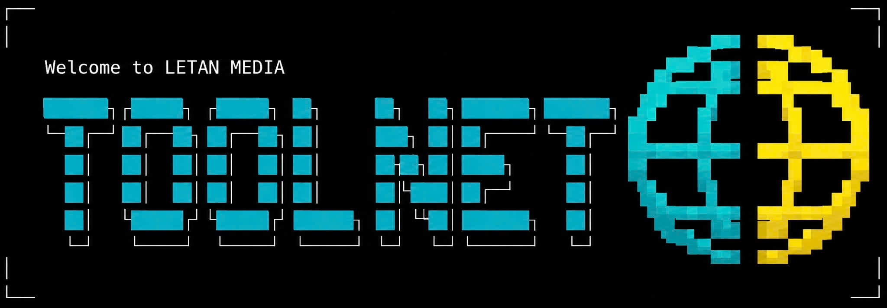
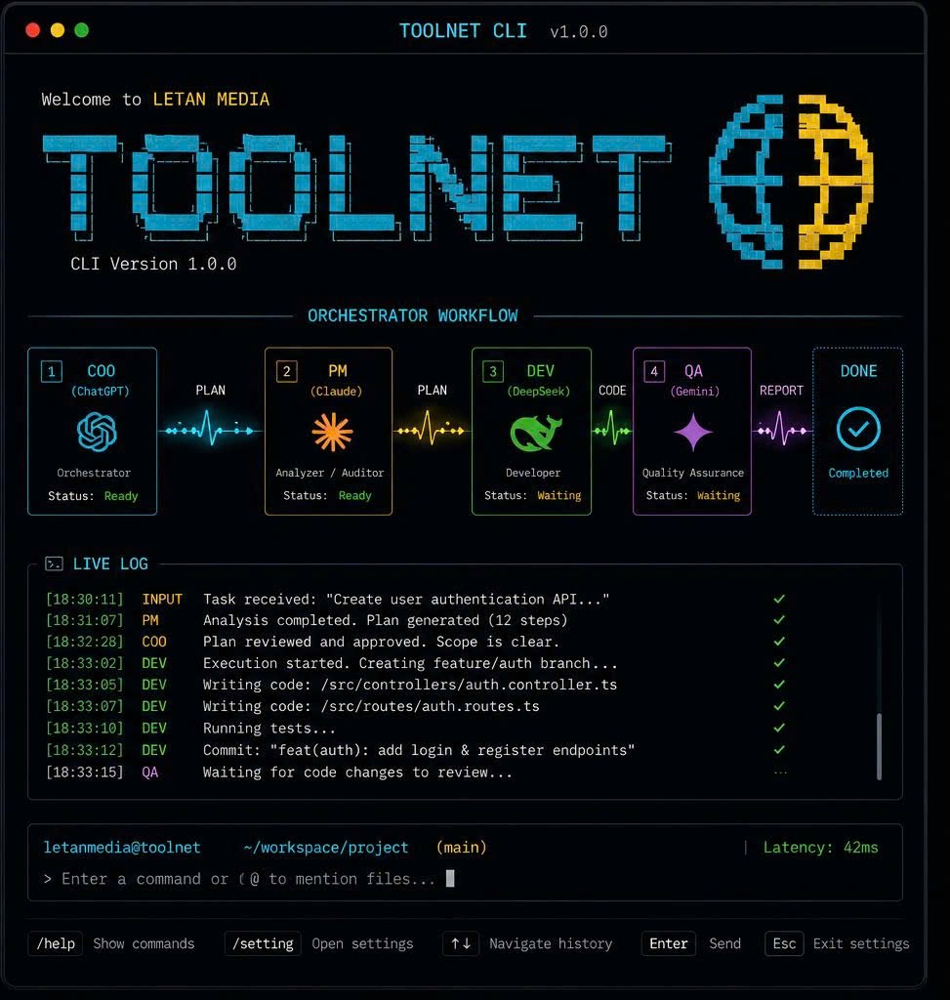

<p align="center">
  
</p>

<p align="center">
  
  
  
  
</p>

# TOOLNET CLI

TOOLNET CLI lets you interact with AI agents directly from your terminal to
write, review, and modify code. It orchestrates four AI roles in a
professional software pipeline with automatic feedback loops:

```
COO (plan) -> PM (audit/risk) -> COO (approve) -> DEV (implement) -> QA (verify)
```

On a blocking QA failure, DEV revisits the code and QA re-verifies, looping
until the task passes or a retry budget is exhausted.

## Các vai trò (Roles)

<p align="center">
  
</p>

Pipeline chạy 4 vai trò AI, mỗi vai trò bị giới hạn quyền rõ ràng để tránh
thiên vị và sai sót:

| Vai trò | Bước | Chức năng |
| --- | --- | --- |
| **COO** (Chief Operating Officer) | `COO_ANALYZE` → `COO_APPROVE` | Nhận task, phân tích và chia nhỏ thành kế hoạch gồm **Scope** (cần làm), **Out-of-Scope** (không được đụng) và danh sách subtask ưu tiên. Sau khi có audit từ PM, COO duyệt bản **Approved Plan** cuối cùng để giao cho DEV. COO **không bao giờ viết code**. |
| **PM** (Project Manager / Risk Auditor) | `PM_AUDIT` | Nhận kế hoạch từ COO, đánh giá **rủi ro** (dependency, breaking change, side-effect), đề xuất **Rollback Plan** cụ thể khi QA gặp lỗi nghiêm trọng, và chỉ ra các điểm scope mơ hồ cần COO làm rõ. PM **chỉ audit, không sửa code, không đổi scope**. |
| **DEV** (Developer) | `DEV_IMPLEMENT` (+ `DEV` retry) | Thực thi code theo đúng **Approved Plan**: chỉ sửa code trong Scope, tuyệt đối không đụng Out-of-Scope, không tự ý refactor hay đổi UI/UX. Trả kết quả dưới dạng **code diff/patch**. Khi QA FAIL, DEV nhận diff cũ + kết quả QA và sửa **chính xác** các lỗi đó. |
| **QA** (Quality Assurance) | `QA_VERIFY` | Độc lập hoàn toàn, **chỉ nhìn code diff trước/sau** (không biết mục đích ban đầu) để tránh bias. Trả về định dạng chuẩn: `STATUS: PASS/FAIL`, `SEVERITY: Critical/High/Medium/Low/None`, và `FINDINGS`. QA block (FAIL mức Critical/High) sẽ quay lại DEV. |

Luồng kiểm soát: COO lập kế hoạch → PM soi rủi ro → COO duyệt → DEV code →
QA kiểm tra → (nếu FAIL) DEV sửa → QA kiểm tra lại (lặp đến khi PASS hoặc hết
ngân sách retry).

## Install

### macOS / Linux / WSL

```bash
curl https://toolnet.tech/install | bash
```

Or build from source (requires Go 1.22+):

```bash
git clone https://toolnet.tech/toolnet-cli
cd toolnet-cli
go build -o /usr/local/bin/toolnet ./cmd/toolnet
```

### Windows

Use WSL, or build from source with Go:

```powershell
go build -o toolnet.exe .\cmd\toolnet
```

## Quick start

```bash
toolnet config                 # validate ~/.toolnet/config.yaml (or set --config)
toolnet login --provider openai   # authenticate via device flow
toolnet run --task "Add input validation to login form"
```

Or just start an **interactive session**:

```bash
toolnet
```

## Interactive session

Running `toolnet` with no subcommand opens a REPL. Type a task and press
Enter to run the full pipeline; type `exit`/`quit` or Ctrl-D to leave.

```
toolnet> Add a /healthz endpoint that returns 200
Created git branch task/9f2c...

=== COO_ANALYZE ===
...
Pipeline finished: QA PASS.
```

The interactive session is ideal for iterative work; the `run` and `resume`
subcommands are better for scripts and CI.

## Configuration

Config lives at `~/.toolnet/config.yaml` (or pass `--config <path>`). A
minimal single-provider setup:

```yaml
coo:
  provider: openai
  model: gpt-4o
  api_key: ${OPENAI_API_KEY}
  endpoint: https://api.openai.com/v1/chat/completions
pm:
  provider: openai
  model: gpt-4o
  api_key: ${OPENAI_API_KEY}
  endpoint: https://api.openai.com/v1/chat/completions
dev:
  provider: anthropic
  model: claude-3-5-sonnet
  api_key: ${ANTHROPIC_API_KEY}
  endpoint: https://api.anthropic.com/v1/messages
qa:
  provider: openai
  model: gpt-4o
  api_key: ${OPENAI_API_KEY}
  endpoint: https://api.openai.com/v1/chat/completions
workflow:
  max_retries: 3
  git_auto_branch: true
  timeout_seconds: 120
```

`${ENV_VAR}` placeholders are resolved from the environment, so secrets are
never committed.

## Multi-account rotation (like 9router)

A role can spread load and quota across many accounts, rotating round-robin
with automatic failover — and skipping accounts that are disabled or become
unhealthy.

### Many keys for one provider

```yaml
coo:
  provider: openai
  model: gpt-4o
  api_keys:
    - ${OPENAI_KEY_1}
    - ${OPENAI_KEY_2}
  endpoint: https://api.openai.com/v1/chat/completions
```

### Many providers in one role (pool)

```yaml
coo:
  provider: openai
  model: gpt-4o
  api_key: ${OPENAI_KEY_1}
  endpoint: https://api.openai.com/v1/chat/completions
  pool:
    - provider: anthropic
      model: claude-3-5-sonnet
      api_key: ${ANTHROPIC_KEY}
      endpoint: https://api.anthropic.com/v1/messages
      weight: 3          # higher weight = more traffic (priority)
    - provider: groq
      model: llama-3.1-8b
      api_key: ${GROQ_KEY}
      endpoint: https://api.groq.com/openai/v1/chat/completions
```

### Options per account

| Field     | Meaning                                                                 |
|-----------|-------------------------------------------------------------------------|
| `weight`  | Relative share of the rotation (priority). Default `1`.                 |
| `disabled`| Skip this account entirely (like `isActive=false`).                    |

### Role-level options

| Field    | Meaning                                                                  |
|----------|--------------------------------------------------------------------------|
| `sticky` | Pin the role to one account for the whole run; fail over only on error.  |

```yaml
coo:
  sticky: true
  api_keys: [${OPENAI_KEY_1}, ${OPENAI_KEY_2}]
  ...
```

`toolnet config` prints the resulting mode, e.g.
`COO: providers=[anthropic openai] (accounts=3, sticky+weighted)`.

## Authentication (`login`)

```bash
toolnet login --provider openai
```

- **Device-flow providers** (openai, gemini, antigravity): prints a URL and
  code; open it, approve, and the CLI polls for the token automatically.
- **Other providers**: use the browser/authorization-code flow.

Run `login` multiple times for the same provider to store **several
accounts**; they are added to the rotation pool (in addition to any
`api_keys` in config). Credentials are encrypted at rest
(`~/.toolnet/credentials.json`, AES-GCM).

### Environment variables

| Variable                                | Purpose                                  |
|-----------------------------------------|------------------------------------------|
| `TOOLNET_OAUTH_CLIENT_ID`               | OAuth client id                          |
| `TOOLNET_OAUTH_DEVICE_ENDPOINT_OPENAI` | Device endpoint (openai has a default)  |
| `TOOLNET_OAUTH_TOKEN_ENDPOINT_OPENAI`  | Token endpoint (openai has a default)   |
| `TOOLNET_OAUTH_DEVICE_ENDPOINT_<PROVIDER>` | Device endpoint for other providers  |
| `TOOLNET_OAUTH_TOKEN_ENDPOINT_<PROVIDER>`  | Token endpoint for other providers   |
| `TOOLNET_CREDENTIAL_KEY`                | Optional passphrase for the credential store |

## Commands

| Command            | Description                                                      |
|--------------------|------------------------------------------------------------------|
| `toolnet`          | Interactive session (REPL).                                      |
| `toolnet run`      | Run the full pipeline for a new task (`--task`, `--bypass`, ...).|
| `toolnet resume`   | Resume an interrupted session by task id (`--task-id`).          |
| `toolnet login`    | Authenticate with a provider via OAuth (`--provider`).          |
| `toolnet config`   | Show config path, validation status, and account rotation.      |
| `toolnet --version` | Print the CLI version.                                          |

Use `--no-git` with `run` or `resume` to disable automatic branch creation
and patch application. If an AI response is not a valid applicable patch,
TOOLNET preserves it under `~/.toolnet/patches/` for manual review.

## Build from source

```bash
go build -o toolnet ./cmd/toolnet
# with a version string:
go build -ldflags "-X main.version=1.2.3" -o toolnet ./cmd/toolnet
```

## License

See repository for details.
